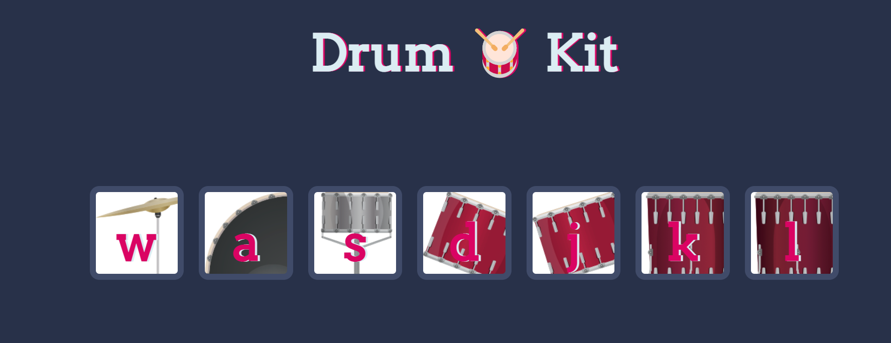

# javascipt-game
Drum kit , a js game , that helps practice the DOM
## Table of contents
* [General info](#general-info)
* [Setup](#setup)


## General info
this project is a simple Drum-kit game .
## Setup
To run this project , install it locally using npm


```
$ cd ..../javascript-game
$ npm install
$npm start 


